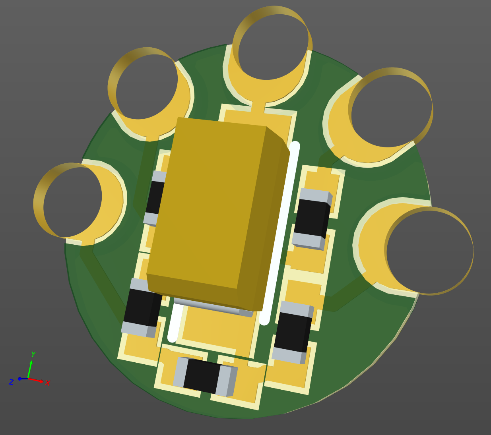

# Acorn Econet Terminator, for "phantom power" networks.

March 2023

This is my implementation of a terminator for Econet Networks that provide 'phantom power' - such as the SJ Networks clock or BeebMaster clock.
It's not suitable for networks where powered termination is required.

The board is ridiculously small, and fits inside a standard DIN Econet plug.

It has been successfully tested on small 'desktop' Econet networks.

## Licence

No warranty is provided, and this work is used at your own risk.  

Licenced as CC BY-SA 3.0

Copyright 2023 Ian Jeffray

